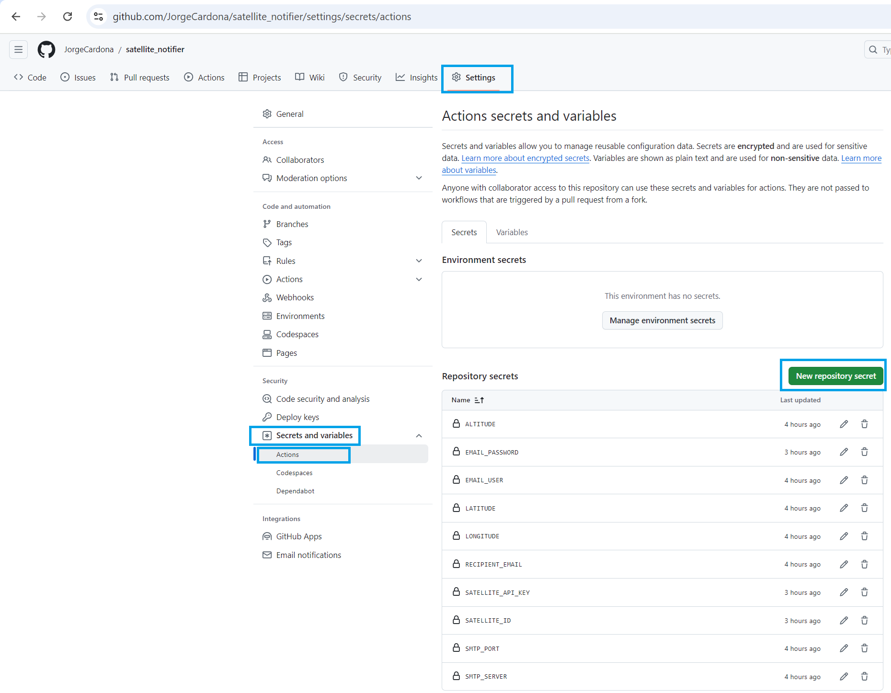

[](https://github.com/JorgeCardona/satellite_notifier/actions/workflows/main.yml)

# Satellite Notifier

Description

Satellite Notifier is a Python application that notifies you via email when a satellite, such as the International Space Station (ISS), passes over your location. It uses the N2YO API to get the satellite's position and sends an email when the satellite is visible from your location. This application is designed to run automatically using GitHub Actions.

# Requirements
Python 3.x (handled by GitHub Actions)
Python packages: requests, smtplib, email (installed automatically in the GitHub Actions workflow)

# Setup
1. Python code
```python
import os
import requests
import smtplib
from email.mime.text import MIMEText
from datetime import datetime, timedelta
import pytz
import pandas as pd

# Retrieve location data from environment variables,  https://www.google.com/maps
LATITUDE = os.getenv('LATITUDE')
LONGITUDE = os.getenv('LONGITUDE')
# https://www.advancedconverter.com/es/herramientas-de-mapa/encontrar-altitud-desde-coordenadas
ALTITUDE = os.getenv('ALTITUDE')

# Retrieve satellite data from environment variables
SATELLITE_ID = os.getenv('SATELLITE_ID')
SATELLITE_API_KEY = os.getenv('SATELLITE_API_KEY')

# Construct the satellite API URL
def construct_url(satellite_id, latitude, longitude, altitude, api_key):
    return f"https://api.n2yo.com/rest/v1/satellite/positions/{satellite_id}/{latitude}/{longitude}/{altitude}/1/&apiKey={api_key}"

# Email configuration
SMTP_SERVER = os.getenv('SMTP_SERVER')
SMTP_PORT = os.getenv('SMTP_PORT')
EMAIL_USER = os.getenv('EMAIL_USER')
# https://myaccount.google.com/apppasswords
EMAIL_PASSWORD = os.getenv('EMAIL_PASSWORD')
RECIPIENT_EMAIL = os.getenv('RECIPIENT_EMAIL')
# Directory and file for store records
LOG_DIRECTORY = os.getenv('LOG_DIRECTORY')
LOG_FILE = os.getenv('LOG_FILE')

def send_email(message):
    """
    Sends an email with the specified message.
    
    Args:
    - message (str): The content of the email.
    """
    msg = MIMEText(message)
    msg['Subject'] = 'Satellite is passing over your area!'
    msg['From'] = EMAIL_USER
    msg['To'] = RECIPIENT_EMAIL

    with smtplib.SMTP(SMTP_SERVER, SMTP_PORT) as server:
        server.starttls()
        server.login(EMAIL_USER, EMAIL_PASSWORD)
        server.sendmail(EMAIL_USER, RECIPIENT_EMAIL, msg.as_string())

def get_look_direction(azimuth):
    """
    Returns the cardinal or intercardinal direction based on the azimuth angle.

    Args:
        azimuth (float): The azimuth angle in degrees (0 to 359).

    Returns:
        str: The direction to look, such as "North", "Northeast", "East", etc.
             If the azimuth is not within 0 to 359 degrees, returns "Invalid azimuth value".
    """
    if azimuth >= 0 and azimuth < 45:
        return "North"
    elif azimuth >= 45 and azimuth < 90:
        return "Northeast"
    elif azimuth >= 90 and azimuth < 135:
        return "East"
    elif azimuth >= 135 and azimuth < 180:
        return "Southeast"
    elif azimuth >= 180 and azimuth < 225:
        return "South"
    elif azimuth >= 225 and azimuth < 270:
        return "Southwest"
    elif azimuth >= 270 and azimuth < 315:
        return "West"
    elif azimuth >= 315 and azimuth < 360:
        return "Northwest"
    else:
        return "Invalid azimuth value"


def convert_utc_to_local(utc_timestamp):
    # Convert UTC timestamp to datetime
    utc_time = datetime.utcfromtimestamp(utc_timestamp)
    
    # Define UTC-5 timezone
    local_tz = pytz.timezone('America/Bogota')  # Bogota is UTC-5
    local_time = utc_time.replace(tzinfo=pytz.utc).astimezone(local_tz)
    
    return local_time.strftime('%Y-%m-%d %H:%M:%S')

def check_satellite(url_satellite):
    """
    Checks if the satellite is visible over the specified location by making a request to the satellite API.
    If the satellite is visible, sends an email notification.

    Args:
        url_satellite (str): The URL to fetch satellite position data from the API.

    Returns:
        None
    """
    response = requests.get(url_satellite)
    data = response.json()
    print('API response:', data)
    
    positions = data.get('positions', [])
    info = data.get('info', {})

    df_positions = pd.DataFrame(positions)
    df_info = pd.DataFrame([info])

    print('Dataframe Position:')
    print(df_positions)
    print()
    print('Dataframe Info:')
    print(df_info)
    print()

    # Retrieve satellite name from info
    satellite_name = info.get('satname', 'Unknown')
    satellite_id = info.get('satid', 'Unknown')

    # Check each position to see if the satellite is over the location
    for position in positions:
        print('Position:', position)
        altitude_response = position.get('sataltitude', 0)
        elevation_response = position.get('elevation', 0)
        azimuth_response = position.get('azimuth', 0)
        ra = position.get('ra', 0)
        dec = position.get('dec', 0)
        timestamp = position.get('timestamp', 0)
        eclipsed = position.get('eclipsed', False)

        direction = get_look_direction(int(azimuth_response))
        # Convert timestamp to local time
        local_time = convert_utc_to_local(timestamp)

        print('Satellite Name:', satellite_name)
        print('Altitude Response:', altitude_response)
        print('Altitude Response:', altitude_response)
        print('Satellite Elevation:', elevation_response)
        print(f"Direction to look: {direction} (Azimuth: {azimuth_response}°)")
        print(f"Right Ascension: {ra}°")
        print(f"Declination: {dec}°")    
        print(f"Timestamp: {timestamp}")
        print(f"Local Time: {local_time}")
        print(f"Eclipsed: {'Yes' if eclipsed else 'No'}")
        
        # Check if the satellite is visible
        if elevation_response > 0 and not eclipsed:
            message = f"Satellite ID {satellite_id} with name {satellite_name} is over your area at {azimuth_response}° azimuth. The direction to look is: {direction}. Visible at {local_time} UTC-5!"
            return message
        
        else:
            print(f"Satellite {satellite_name} is not over your area. Altitude: {altitude_response} meters, Direction: {direction}, Azimuth: {azimuth_response}°, Eclipsed: {'Yes' if eclipsed else 'No'}.")

            return None

def save_message_to_file(body_message, log_directory, log_file):
    """
    Saves the body_message to a file with a timestamp in the specified directory.
    
    Args:
    - body_message (str): The message to save.
    - log_directory (str): The directory where the log file will be saved.
    - log_file (str): The name of the log file.
    """
    # Get the current timestamp
    timestamp = datetime.now().strftime('%Y-%m-%d %H:%M:%S')
    
    # Create the directory if it doesn't exist
    try:
        if not os.path.exists(log_directory):
            os.makedirs(log_directory)
    except Exception as e:
        print(f'Error creating directory: {e}')
        return  # Exit the function if we can't create the directory
    
    # Full path to the file
    file_path = os.path.join(log_directory, log_file)

    try:
        # Open the file in append mode
        with open(file_path, mode='a', encoding='utf-8') as file:
            # Write the timestamp and body_message to the file
            file.write(f"{timestamp} - {body_message}\n")
        
        print(f'Message saved to {file_path}')
    
    except Exception as e:
        print(f'Error saving message to file: {e}')
    
# validate the satellite list url URL and run the check
def check_multiple_satellites():
    """
    Retrieves the list of satellite IDs from the environment variable and performs a satellite check for each ID.
    """
    satellite_ids = os.getenv('SATELLITE_ID', '').split(',')

    visible_satellites = list()

    for satellite_id in satellite_ids:
        satellite_id = satellite_id.strip()  # Remove any leading/trailing whitespace
        if satellite_id:  # Check if the satellite_id is not empty
            print('Satellite ID:', satellite_id)
            # Construct the satellite URL for the current ID and run the check
            url_satellite = construct_url(satellite_id, LATITUDE, LONGITUDE, ALTITUDE, SATELLITE_API_KEY)

            satelite = check_satellite(url_satellite)
            if satelite:
                visible_satellites.append(satelite)
    
    if visible_satellites:
        print('List of Visible Satellites:')
        print(visible_satellites)

        body_message = '\n'.join(visible_satellites)
        send_email(body_message)
        print('Email sent successfully.')
        save_message_to_file(body_message, log_directory=LOG_DIRECTORY, log_file=LOG_FILE)

# Call the new function to process the list of satellite IDs
check_multiple_satellites()
```

2. Configure Environment Secrets in GitHub
This application uses environment variables to handle configuration securely. To set these up in GitHub:

Go to your GitHub repository.

Navigate to Settings > Secrets and variables > Actions > New repository secret.

Add the following secrets:
```
LATITUDE: Your location's latitude.
LONGITUDE: Your location's longitude.
ALTITUDE: Your location's altitude.
SATELLITE_ID: The ID of the satellite (e.g., 25544 for the ISS).
SATELLITE_API_KEY: Your N2YO API key.
SMTP_SERVER: Your SMTP server (e.g., smtp.gmail.com).
SMTP_PORT: The SMTP server port (e.g., 587 for Gmail).
EMAIL_USER: Your email address used to send the notification.
EMAIL_PASSWORD: Your email password or app-specific password.
RECIPIENT_EMAIL: The email address where you want to receive the notifications.
LOG_DIRECTORY: The directory path where log files will be stored, e.g., 'satellite_history/'.
LOG_FILE: The name of the log file to save satellite notification messages, e.g., 'satellite_log.txt'.
```




3. GitHub Actions Workflow
The GitHub Actions workflow file (.github/workflows/main.yml) is already configured in this repository. It is set to run every 60 minutes and can be triggered manually through the GitHub Actions tab.

Here is the workflow configuration:

```yaml
# https://github.com/actions
# https://github.com/marketplace?type=actions

name: Satellite Notifier

on:
  schedule:
    # The cron runs always in UTC time.
    # - cron: '0 0-4,5-12 * * 6,0'  # Runs in UTC, corresponding to 19:00-07:00 UTC-5
    # This cron is adjusted to run in UTC-5
    # UTC-5 means adding 5 hours to UTC time
    # To run between 19:00 and 07:00 UTC-5, we adjust the range in UTC
    - cron: '0 0-12/4 * * 6,0'  # Runs the workflow between 19:00 and 07:00 in UTC-5 every 4 hours (19:00, 23:00, 03:00, 07:00) on Saturday (6) and Sunday (0)
  workflow_dispatch:  # Allows manual triggering if needed

jobs:
  run:
    runs-on: ubuntu-latest

    permissions:
      # Give the default GITHUB_TOKEN write permission to commit and push the
      # added or changed files to the repository.
      contents: write
      
    steps:
      - name: Checkout repository # download code from repository 
        uses: actions/checkout@v4

      - name: Set up Python
        uses: actions/setup-python@v5
        with:
          python-version: '3.11.7' # Sets up Python 3.11.7

      - name: Install dependencies
        run: |
          python -m pip install --upgrade pip
          pip install requests
          pip install pytz
          pip install pandas

      - name: Run script
        env: # Captures the values from GitHub Actions secrets and converts them into environment variable values.
          SATELLITE_API_KEY: ${{ secrets.SATELLITE_API_KEY }}
          SMTP_SERVER: ${{ secrets.SMTP_SERVER }}
          SMTP_PORT: ${{ secrets.SMTP_PORT }}
          EMAIL_USER: ${{ secrets.EMAIL_USER }}
          EMAIL_PASSWORD: ${{ secrets.EMAIL_PASSWORD }}
          RECIPIENT_EMAIL: ${{ secrets.RECIPIENT_EMAIL }}
          LATITUDE: ${{ secrets.LATITUDE }}
          LONGITUDE: ${{ secrets.LONGITUDE }}
          ALTITUDE: ${{ secrets.ALTITUDE }}
          SATELLITE_ID: ${{ secrets.SATELLITE_ID }}
          LOG_DIRECTORY: ${{ secrets.LOG_DIRECTORY }}
          LOG_FILE: ${{ secrets.LOG_FILE }}  
        run: python main.py
        # This step runs the Python script with the environment variables needed for the satellite notification process.

      - name: Get current timestamp
        id: get_timestamp
        run: echo "timestamp_now=$(date +'%Y-%m-%d %H:%M:%S')" >> $GITHUB_ENV # Create 'timestamp_now' variable and store the current date and time in GITHUB_ENV

      - name: Auto commit and push changes
        uses: stefanzweifel/git-auto-commit-action@v5
        with:
          commit_message: Automated Change - ${{ env.timestamp_now }} # Commit message that includes the current timestamp from the variable 'timestamp_now'
          commit_user_name: My GitHub Actions Bot
          commit_user_email: ${{ secrets.EMAIL_USER }}
          commit_author: 'Jorge Cardona <${{ secrets.EMAIL_USER }}>'
```

4. Run the Workflow Manually (Optional)
To manually trigger the workflow:

Go to the Actions tab in your repository.
Select the Satellite Notifier workflow.
Click Run workflow.


5. Satellite Visibility Data and Timing
```
https://heavens-above.com
https://spotthestation.nasa.gov
```
