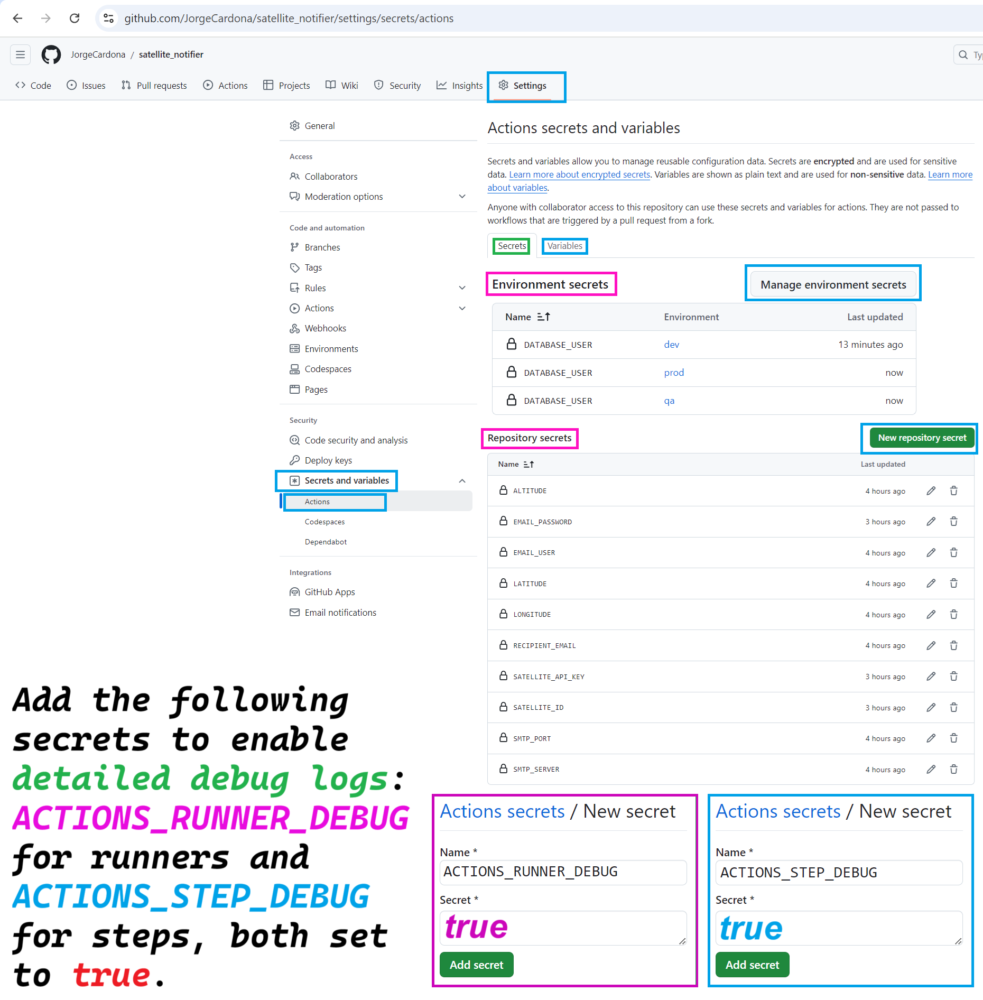

# Satellite Notifier

Description

Satellite Notifier is a Python application that notifies you via email when a satellite, such as the International Space Station (ISS), passes over your location. It uses the N2YO API to get the satellite's position and sends an email when the satellite is visible from your location. This application is designed to run automatically using GitHub Actions.

# Requirements
Python 3.x (handled by GitHub Actions)
Python packages: requests, smtplib, email (installed automatically in the GitHub Actions workflow)

# Setup
1. Python code
```python
import os
import requests
import smtplib
from email.mime.text import MIMEText

# Retrieve location data from environment variables,  https://www.google.com/maps
LATITUDE = os.getenv('LATITUDE')
LONGITUDE = os.getenv('LONGITUDE')
# https://www.advancedconverter.com/es/herramientas-de-mapa/encontrar-altitud-desde-coordenadas
ALTITUDE = os.getenv('ALTITUDE')

# Retrieve satellite data from environment variables
SATELLITE_ID = os.getenv('SATELLITE_ID')
SATELLITE_API_KEY = os.getenv('SATELLITE_API_KEY')

# Construct the satellite API URL
def construct_url(satellite_id, latitude, longitude, altitude, api_key):
    return f"https://api.n2yo.com/rest/v1/satellite/positions/{satellite_id}/{latitude}/{longitude}/{altitude}/1/&apiKey={api_key}"

# Email configuration
SMTP_SERVER = os.getenv('SMTP_SERVER')
SMTP_PORT = os.getenv('SMTP_PORT')
EMAIL_USER = os.getenv('EMAIL_USER')
# https://myaccount.google.com/apppasswords
EMAIL_PASSWORD = os.getenv('EMAIL_PASSWORD')
RECIPIENT_EMAIL = os.getenv('RECIPIENT_EMAIL')

def send_email(message):
    """
    Sends an email with the specified message.
    
    Args:
    - message (str): The content of the email.
    """
    msg = MIMEText(message)
    msg['Subject'] = 'Satellite is passing over your area!'
    msg['From'] = EMAIL_USER
    msg['To'] = RECIPIENT_EMAIL

    with smtplib.SMTP(SMTP_SERVER, SMTP_PORT) as server:
        server.starttls()
        server.login(EMAIL_USER, EMAIL_PASSWORD)
        server.sendmail(EMAIL_USER, RECIPIENT_EMAIL, msg.as_string())

def check_satellite(url_satellite):
    """
    Checks if the satellite is over the specified location and sends an email if it is.
    
    Args:
    - url_satellite (str): The URL to fetch satellite data.
    """
    response = requests.get(url_satellite)
    data = response.json()
    print('API response:', data)
    
    positions = data.get('positions', [])
    info = data.get('info', {})

    # Retrieve satellite name from info
    satellite_name = info.get('satname', 'Unknown')

    # Check each position to see if the satellite is over the location
    for position in positions:
        print('Position:', position)
        altitude_response = position.get('sataltitude', 0)
        
        print('Satellite Name:', satellite_name)
        print('Satellite ID:', SATELLITE_ID)
        print('Altitude Response:', altitude_response)
        
        if altitude_response > int(ALTITUDE):
            send_email(f"Satellite {satellite_name} is over your area!")
            print('Email sent successfully.')
            break  # Exit loop after sending the email

        else:
            print(f"Satellite {satellite_name} is far from your area with an altitude of {altitude_response}.")

# Construct the satellite URL and run the check
url_satellite = construct_url(SATELLITE_ID, LATITUDE, LONGITUDE, ALTITUDE, SATELLITE_API_KEY)
check_satellite(url_satellite)
```

2. Configure Environment Secrets in GitHub
This application uses environment variables to handle configuration securely. To set these up in GitHub:

Go to your GitHub repository.

Navigate to Settings > Secrets and variables > Actions > New repository secret.

Add the following secrets:
```
LATITUDE: Your location's latitude.
LONGITUDE: Your location's longitude.
ALTITUDE: Your location's altitude.
SATELLITE_ID: The ID of the satellite (e.g., 25544 for the ISS).
SATELLITE_API_KEY: Your N2YO API key.
SMTP_SERVER: Your SMTP server (e.g., smtp.gmail.com).
SMTP_PORT: The SMTP server port (e.g., 587 for Gmail).
EMAIL_USER: Your email address used to send the notification.
EMAIL_PASSWORD: Your email password or app-specific password.
RECIPIENT_EMAIL: The email address where you want to receive the notifications.
```




3. GitHub Actions Workflow
The GitHub Actions workflow file (.github/workflows/main.yml) is already configured in this repository. It is set to run every 60 minutes and can be triggered manually through the GitHub Actions tab.

Here is the workflow configuration:

```yaml
name: Satellite Notifier

on:
  schedule:
    - cron: '*/60 * * * *'  # Ejecutar cada 60 minutos
  workflow_dispatch:  # Permite ejecutar manualmente si es necesario

jobs:
  run:
    runs-on: ubuntu-latest
    steps:
      - name: Checkout repository
        uses: actions/checkout@v2
      - name: Set up Python
        uses: actions/setup-python@v2
        with:
          python-version: '3.x'
      - name: Install dependencies
        run: |
          python -m pip install --upgrade pip
          pip install requests
      - name: Run script
        env:
          SATELLITE_API_KEY: ${{ secrets.SATELLITE_API_KEY }}
          SMTP_SERVER: ${{ secrets.SMTP_SERVER }}
          SMTP_PORT: ${{ secrets.SMTP_PORT }}
          EMAIL_USER: ${{ secrets.EMAIL_USER }}
          EMAIL_PASSWORD: ${{ secrets.EMAIL_PASSWORD }}
          RECIPIENT_EMAIL: ${{ secrets.RECIPIENT_EMAIL }}
          LATITUDE: ${{ secrets.LATITUDE }}
          LONGITUDE: ${{ secrets.LONGITUDE }}
          ALTITUDE: ${{ secrets.ALTITUDE }}
          SATELLITE_ID: ${{ secrets.SATELLITE_ID }}
        run: python main.py
```

4. Run the Workflow Manually (Optional)
To manually trigger the workflow:

Go to the Actions tab in your repository.
Select the Satellite Notifier workflow.
Click Run workflow.
